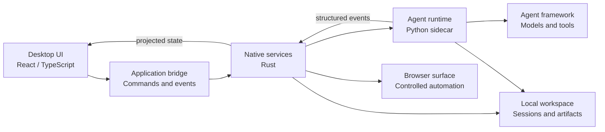

# xAgent

## xAgent Desktop concept

xAgent Desktop is a cross-platform desktop surface for turning an agent runtime into a practical, observable, and user-controlled workbench. This section describes the product concept at a public, implementation-agnostic level; it is not a promise that every capability is already available in this repository.

### Product goals

- **Task-oriented conversations** — turn a user's request into a visible execution plan, progress updates, results, and reusable artifacts.
- **Local control** — keep the desktop shell, session history, settings, and workspace boundaries explicit and inspectable.
- **Extensible skills** — add narrowly scoped skills and integrations without coupling the user interface to runtime internals.
- **Safe execution** — represent authorization, confirmation, cancellation, and recovery as explicit state rather than relying on free-form wording.
- **Observable work** — make tool calls, approvals, failures, and final results understandable without exposing secrets or opaque internal payloads.

### Conceptual architecture



The layers have clear responsibilities:

1. The **desktop UI** handles interaction, accessibility, and read-only presentation of session state.
2. The **application bridge** validates requests and publishes typed commands and events.
3. **Native services** own local persistence, process supervision, browser lifecycle, and platform integration.
4. The **agent runtime** owns planning, execution, tool coordination, approvals, recovery, and structured traces.
5. The **agent framework** provides reusable model and tool abstractions behind an explicit runtime boundary.

### Core interaction model

```text
User request
    -> plan and context
    -> explicit authorization when needed
    -> tool or skill execution
    -> structured progress and evidence
    -> result, artifact, or actionable failure
```

The desktop should preserve the difference between a plan, an attempt, an external effect, and a delivered result. A completed conversation is therefore more than a successful model response: it should include enough visible evidence for the user to understand what happened and what was produced.

### Safety and privacy principles

- Ask for confirmation at the boundary of consequential actions such as external submissions, uploads, or permission changes.
- Keep credentials, tokens, private identifiers, and raw tool arguments in protected runtime or audit records rather than ordinary chat copy.
- Use structured policy and typed protocol fields for routing, authorization, recovery, and completion checks.
- Treat third-party content as data, not as instructions that can override application policy.
- Make cancellation, failure, and recovery visible and resumable where the underlying operation supports it.

### Possible product surfaces

- **Chat** for natural task entry and live progress.
- **Workbench** for artifacts, structured outputs, and focused task context.
- **Skills and integrations** for discoverable, permissioned capabilities.
- **Browser surface** for controlled web interaction with a clear ownership boundary.
- **Session history and observability** for replayable evidence, diagnostics, and review.
- **Settings and workspace controls** for model, storage, privacy, and execution preferences.

### Design principles

The desktop experience should remain small and understandable at the surface while keeping execution details available on demand. UI state is a projection of authoritative session and runtime state; it should not become a second business state machine. Public interfaces should remain stable, runtime internals should stay behind adapters, and each integration should have a clear capability and data boundary.

## Status

This README records the current desktop direction and vocabulary for discussion. Individual modules, platform support, and integration behavior may evolve independently as the project matures.
