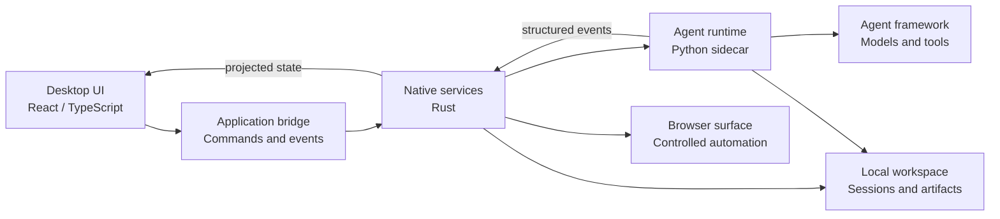
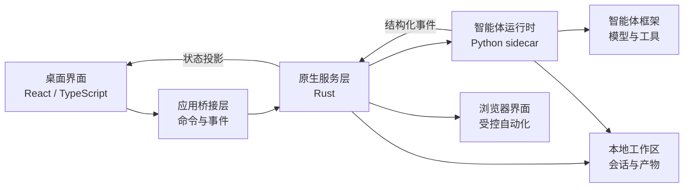

# xAgent

## xAgent Desktop concept

xAgent Desktop is a cross-platform desktop surface for turning an agent runtime into a practical, observable, and user-controlled workbench. This section describes the product concept at a public, implementation-agnostic level; it is not a promise that every capability is already available in this repository.

### Product goals

- **Task-oriented conversations** — turn a user's request into a visible execution plan, progress updates, results, and reusable artifacts.
- **Local control** — keep the desktop shell, session history, settings, and workspace boundaries explicit and inspectable.
- **Extensible skills** — add narrowly scoped skills and integrations without coupling the user interface to runtime internals.
- **Safe execution** — represent authorization, confirmation, cancellation, and recovery as explicit state rather than relying on free-form wording.
- **Observable work** — make tool calls, approvals, failures, and final results understandable without exposing secrets or opaque internal payloads.

### Conceptual architecture



The layers have clear responsibilities:

1. The **desktop UI** handles interaction, accessibility, and read-only presentation of session state.
2. The **application bridge** validates requests and publishes typed commands and events.
3. **Native services** own local persistence, process supervision, browser lifecycle, and platform integration.
4. The **agent runtime** owns planning, execution, tool coordination, approvals, recovery, and structured traces.
5. The **agent framework** provides reusable model and tool abstractions behind an explicit runtime boundary.

### Core interaction model

```text
User request
    -> plan and context
    -> explicit authorization when needed
    -> tool or skill execution
    -> structured progress and evidence
    -> result, artifact, or actionable failure
```

The desktop should preserve the difference between a plan, an attempt, an external effect, and a delivered result. A completed conversation is therefore more than a successful model response: it should include enough visible evidence for the user to understand what happened and what was produced.

### Safety and privacy principles

- Ask for confirmation at the boundary of consequential actions such as external submissions, uploads, or permission changes.
- Keep credentials, tokens, private identifiers, and raw tool arguments in protected runtime or audit records rather than ordinary chat copy.
- Use structured policy and typed protocol fields for routing, authorization, recovery, and completion checks.
- Treat third-party content as data, not as instructions that can override application policy.
- Make cancellation, failure, and recovery visible and resumable where the underlying operation supports it.

### Possible product surfaces

- **Chat** for natural task entry and live progress.
- **Workbench** for artifacts, structured outputs, and focused task context.
- **Skills and integrations** for discoverable, permissioned capabilities.
- **Browser surface** for controlled web interaction with a clear ownership boundary.
- **Session history and observability** for replayable evidence, diagnostics, and review.
- **Settings and workspace controls** for model, storage, privacy, and execution preferences.

### Design principles

The desktop experience should remain small and understandable at the surface while keeping execution details available on demand. UI state is a projection of authoritative session and runtime state; it should not become a second business state machine. Public interfaces should remain stable, runtime internals should stay behind adapters, and each integration should have a clear capability and data boundary.

## Status

This README records the current desktop direction and vocabulary for discussion. Individual modules, platform support, and integration behavior may evolve independently as the project matures.

## xAgent Desktop 概念设计（中文版）

xAgent Desktop 是将智能体运行时转化为实用、可观测且由用户掌控的工作台的跨平台桌面载体。本节以公开、与具体实现解耦的方式描述产品概念，不代表当前仓库已经具备全部能力。

### 产品目标

- **面向任务的对话**：将用户请求转化为可见的执行计划、进度更新、结果和可复用产物。
- **本地可控**：明确展示桌面 Shell、会话历史、设置和工作区边界，使其可检查、可理解。
- **可扩展技能**：通过边界清晰的技能和集成扩展能力，避免界面直接耦合运行时内部实现。
- **安全执行**：将授权、确认、取消和恢复建模为显式状态，不依赖自由文本进行关键决策。
- **过程可观测**：让工具调用、审批、失败和最终结果易于理解，同时不暴露密钥或不透明的内部载荷。

### 概念架构



各层职责保持清晰：

1. **桌面界面**负责交互、无障碍以及会话状态的只读展示。
2. **应用桥接层**负责校验请求，并发布类型明确的命令和事件。
3. **原生服务层**负责本地持久化、进程监管、浏览器生命周期和平台集成。
4. **智能体运行时**负责规划、执行、工具协同、审批、恢复和结构化 Trace。
5. **智能体框架**在明确的运行时边界后提供可复用的模型和工具抽象。

### 核心交互模型

```text
用户请求
    -> 计划与上下文
    -> 必要时进行显式授权
    -> 工具或技能执行
    -> 结构化进度与证据
    -> 结果、产物或可操作的失败信息
```

桌面应保持计划、执行尝试、外部影响和最终交付之间的区别。因此，一次完成的对话不应只是模型返回成功，还应提供足够的可见证据，让用户理解发生了什么以及产生了什么。

### 安全与隐私原则

- 在外部提交、上传或权限变更等具有实际影响的操作边界请求确认。
- 将凭据、令牌、私有标识符和原始工具参数保存在受保护的运行时或审计记录中，不直接放入普通聊天文案。
- 使用结构化策略和类型化协议字段驱动路由、授权、恢复和完成检查。
- 将第三方内容视为数据，而不是可以覆盖应用策略的指令。
- 在底层操作支持的情况下，使取消、失败和恢复过程可见且可继续。

### 可能的产品界面

- **聊天**：输入自然语言任务并查看实时进度。
- **工作台**：查看产物、结构化输出和聚焦的任务上下文。
- **技能与集成**：发现并使用经过权限控制的能力。
- **浏览器界面**：在清晰的所有权边界内执行受控网页交互。
- **会话历史与可观测性**：查看可复核的证据、诊断信息和执行记录。
- **设置与工作区控制**：管理模型、存储、隐私和执行偏好。

### 设计原则

桌面体验在表层应保持简洁易懂，同时按需提供执行细节。界面状态是权威会话状态和运行时状态的投影，不应成为第二套业务状态机。公共接口应保持稳定，运行时内部结构应隐藏在适配器之后，每个集成都应拥有清晰的能力边界和数据边界。

### 状态说明

本 README 用于记录当前桌面方向和讨论所需的概念词汇。随着项目发展，各模块、平台支持范围和集成行为都可能独立演进。
